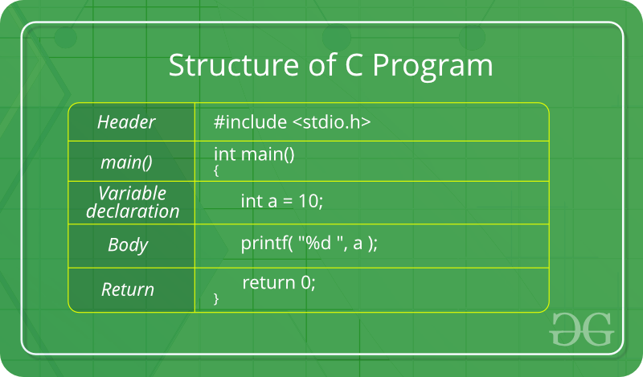

# *C Crash Course*


En este documento se brindará una breve introducción al lenguaje C. 
Se asume que el lector tiene conocimientos de algoritmía y es deseable que conozca la sintaxis de algún otro lenguaje de programación como **Java** o Python.

## ¿Por qué aparece el lenguaje C? ¿Por qué sigue estando vigente?

Lenguaje C nace en los 70s como respuesta a la necesidad que tenían los desarrolladores de software de la época para escribir sus programas de cómputo en un lenguaje que permitiera la portabilidad de sus aplicaciones.
Estos desarrolladores escribían la mayoría de su código en lenguaje máquina (ensamblador o *assembler*) el cual ofrece un conjunto de instrucciones condicionado por la arquitectura del computador donde este se ejecutará.
Es decir, un desarrollador escribía su código en el lenguaje ensamblador para el equipo de cómputo fabricado por *X* y ese código no podría ser utilizado en el equipo de cómputo fabricado por *Y*. 
Las arquitecturas de los computadores estaban poco estandarizadas y había un número de posibilidades incompatibles entre ellas.

Dennis Ritchie con otros colegas desarrollan el lenguaje C y el cual se presenta como el lenguaje de alto nivel más próximo al bajo nivel. 
Esto quiere decir que los desarrolladores no necesitaba aprender el lenguaje ensamblador de un equipo de cómputo en particular sino que aprendían el lenguaje C y era trabajo del **compilador** de C convertir esas instrucciones a instrucciones en lenguaje ensamblador del equipo donde se quería a ejecutar el programa.

Hoy en día el lenguaje C sigue manteniendo su vigencia debido a la relevancia y auge que tienen los ambientes IoT (*Internet of Things*).
Estos ambientes se caracterizan por ser poco estandarizados (muchos fabricantes con diferentes propuestas de dispositivos) pero que requieren de soluciones de software estandarizadas y eficientes que permitan comunicar a los diferentes aplicativos del ecosistema IoT.
Es por eso que el [TIOBE index](https://www.tiobe.com/tiobe-index/) declaró al lenguaje de programación C como el lenguaje del 2019 [enlace](https://www.infoworld.com/article/3512821/c-takes-tiobe-index-language-of-the-year-honors.html).

A continuación comenzaremos nuestra incursión en el lenguaje C.
Primero, se dará una breve introducción a la forma como se compila un programa escrito en el lenguaje C.
Esto con el fin de tener los elementos para seguir la presente guía de una forma más activa.
Después, se describirán las partes que constituyen a un programa en C.
Se dará una descripción de cada una de ellas con un cierto nivel de profundidad.
Seguidamente, se mencionarán las diferentes etapas que experimenta un programa desde el código fuente hasta su versión final como aplicativo o archivo binario. 
Finalmente, se revisarán unos pocos pero comunes mensajes que se pueden encontrar a la hora de compilar un programa en C y como evitar que estos aparezcan.

## ¿Cómo se ejecuta un programa en C?

A diferencia de muchos lenguajes modernos que son interpretados, el lenguaje C requiere que para poderse ejecutar este se compile primero.
Existen muchas implementaciones de compiladores para el lenguaje C.
De acuerdo a [este sitio](https://en.wikipedia.org/wiki/List_of_compilers) ¿Cuántos compiladores de C se pueden contar?

Uno de los compiladores más populares es el compilador GNU C. 
Este compilador nace bajo el proyecto GNU (*GNU is not UNIX*) y el cual tiene como propósito brindar de manera libre y abierta la implementación de aquellas herramientas que se encuentran regularmente en un sistema operativo Unix. 
Una de esas herramientas es el compilador de C.

La forma más básica de uso del compilador GNU C es como sigue:

```
gcc archivo.c
```

Donde `archivo.c` es un archivo que contiene las instrucciones de un programa en C. 
Al ejecutar este comando desde una terminal, y asumiendo que el archivo `archivo.c` este bien escrito, se generará un archivo llamado `a.out` el cual es la versión binaria del programa `archivo.c`.

Por ejemplo, asumamos que el archivo `archivo.c` contiene lo siguiente:

```
#include <stdio.h>

int main(int argc, char** argv) {

  printf("Hola mundo\n");

  return 0;
}
```

Si usted compila el programa, `gcc archivo.c`, tendrá un archivo llamado `a.out` el cual podrá ejecutar desde la terminal de la siguiente forma:

```
./a.out
```

Es posible cambiar el nombre del archivo generado después de compilar el programa en C.
Si desde la terminal ejecuta:

```
gcc archiv.c -o archivo
```

El resultado de compilar el archivo `archivo.c` no será `a.out` sino `archivo`.
Este entonces se podrá ejecutar desde la terminal de la siguiente manera:

```
./archivo
```


## Estructura de un programa en C

La figura abajo muestra la estructura que sigue todo programa en C.
Un programa en C consta en términos generales de los siguientes ítems:

* *Header* o archivos de cabecera.
* *main()* definición de la función `main`.
* *Declaración de variables* al interior de la función, se definen las variables que se requieren dentro de dicha función.
* *Cuerpo* es la parte de la función que establece las instrucciones que debe ejecutar esta en su interior.
* *Return* es la instrucción que indica lo que debe devolver la
 función. **Nota** No todas las funciones en C tienen que devolver un valor. Aquellas funciones que se espera devuelvan ningún valor, deben tener la palabra clave `void` al lado izquierdo del nombre de la función. Ejemplo: `void main()`.




### Archivos de cabecera

Inicialmente, un programa en C tiene la definición de los archivos de cabecera.
Estos archivos de cabecera tienen extensión `.h`.
Los archivos de cabecera en el lenguaje C contiene principalmente dos tipos de información:

* La definición de nuevos tipos de datos.
* La definición de los prototipos de funciones que se encuentran implementados en alguna librería.

Algunos archivos de cabecera se pueden enumerar los siguientes:

* `stdio.h` define la funciones más importantes para entrada y salida de datos.
* `string.h` define funciones para el manejo de cadenas de caracteres.
* `math.h` define algunas funciones de tipo matemático.

La forma como se incluye uno de estos archivos de cabecera es a través de la instrucción `#include `.
A la derecha de esta instrucción se ubica entre los caracteres `<` y  `>` el nombre del archivo de cabecera.
Una definicón válida de un archivo de cabecera en un programa en C es como sigue:

```
#include <stdio.h>
```

En la sección [Mensajes del compilador asociados con los archivos de cabecera](#errores-archivos-cabecera) veremos dos casos típicos que se presentan cuando no se incluyen los archivos de cabecera.

---

* Los archivos de cabecera son archivos que tienen extensión `.h`.
* Estos archivos tienen la definición de los prototipos de ciertas funciones y de nuevos tipos de datos.
* La forma de incluir un archivo de cabecera en un programa en C es a través de la instrucción `#include <archivo.h>`, donde `archivo.h` puede ser: `stdio.h`, `malloc.h`, `time.h`, `string.h`, `math.h`, etc.

---

### Definición de funciones 

En C todas las instrucciones que deseamos que un computador ejecute, deben estar definidas dentro de una función.
Si desea que un código en C se convierta en un aplicativo entonces es obligatorio definir la función `main()`.
Si esta función no está definida, usted podrá compilar su código, generar un binario pero no podrá generar un programa ejecutable. 

Una función `main` se puede definir de muchas maneras.

* `void main(void)` esta definición de la función `main` no recibe argumentos y no devuelve nada. [Código ejemplo aquí](code/voidvoid.c).

```
#include <stdio.h>

void main(void) {
  int i, b = 4;

  for (i = 0; i < b; i++)
    printf("%d\n",i);
}
```

* `int main(int argc, char** argv)` esta es la forma clásica de definir la función `main` en C. La función devuelve un valor de tipo entero y recibe dos argumentos: un entero y una matriz de caracteres. [Código ejemplo aquí](code/main.c). 

```
#include <stdio.h>

int main(int argc, char** argv){
  int i;
  // Escriba en C un ciclo (i) que va de 0 hasta argc - 1 (incluido)
  // e imprime la cadena que esta en la posicion argv[i].

  return 0;
}
```

¿Se le ocurre otra variante para definir una función `main`? Escriba un programa que implemente dicha variante.

El usuario también puede definir sus propias funciones e invocarlas dentro de la función `main()`.

```
#include <stdio.h>

void mensaje();

int main(int argc, char** argv) {
  mensaje();
  return 0;
}

void mensaje() {
  printf("hola mundo\n");
}
```

---

### Declaración de variables

El lenguaje C cuenta con una gran cantidad de tipos de datos.
Existen tipos de datos básicos (`char`, `int`, `double`, `long`) y tipos derivados como las estructuras, los arreglos, uniones, etc.

Revise este [enlace](https://www.tutorialspoint.com/cprogramming/c_data_types.htm) y obtenga la respuesta a las siguientes preguntas:

* ¿Cuál es el tipo de dato en C que tiene mayor capacidad para representar un valor numérico?
* Un tipo de dato que tenga una longitud de 32 bits ¿Cuál es el valor más grande capaz de representar sin signo?
* Una función que tenga el siguiente prototipo `void x(void)` ¿Qué indica?
* Explique lo que significa el tipo de dato `void *`.

---

### El cuerpo de la función

Dentro de la definición de las instrucciones se pueden considerar las siguientes:

* Enunciados sencillos
* Enunciados compuestos
  * Condicionales
  * Ciclos (*loops*)
    * `while`
    * `for`

Más ejemplos [aquí](http://cs.yale.edu/homes/aspnes/pinewiki/C(2f)Statements.html).  

---

### Return

La última instrucción que ejecuta una función es la que comienza con la palabra clave `return`. 
Dicho esto el `return` se espera sea la última instrucción que se ejecute [código](code/normalreturn.c).

```
#include <stdio.h>

int main(int argc, char** argv) {
  double pi;

  pi = 3.14159;
  printf("%.3lf\n", pi);

  return 1;
}
```

Pero desde lo sintáctico este código sigue estando correcto [código](code/diferentereturn.c).

```
#include <stdio.h>

int main(int argc, char** argv) {
  double pi;

  pi = 3.14159;
  return 1;
  printf("%.3lf\n", pi);

}
```

---

## Proceso de compilación

Al momento usted ha ejecutado el comando `gcc` para generar a partir de un archivo `.c` un aplicativo que se puede ejecutar desde la línea de comandos.
Sin embargo, ese único paso que usted ejecuta lleva a cabo las siguientes tareas:

* Preprocesamiento
* Compilación
* Ensamblaje
* Enlace

Supongamos el siguiente código:

```
#define inc(a,b) a = a + b
void main(void){
  int a, b;
  inc(a,b);
}
```

Almacene este código en un archivo llamado `simple.c`. 

### Preprocesamiento

El preprocesamiento es aquella etapa de la compilación donde todas las directivas de precompilación (instrucciones que comienzan con el símbolo pragma (`#`) son "removidas".
Para observar la salida de esta etapa de la compilación ejecute:

```
gcc -E simple.c
```

Aparecerá algo en pantalla como lo siguiente:

```
# 1 "code/simple.c"
# 1 "<built-in>" 1
# 1 "<built-in>" 3
# 361 "<built-in>" 3
# 1 "<command line>" 1
# 1 "<built-in>" 2
# 1 "code/simple.c" 2


void main(void){
  int a, b;
  a = a + b;
}
```

Observe que la línea que contenía la instrucción `inc(a,b)` fue reemplazada por la instrucción `a = a + b`.

Si usted desea que esta salida quede directamente en un archivo, ejecute lo siguiente:

```
gcc -E simple.c -i simple.i
```

### Compilación

En esta etapa se genera el código en assembler del programa.
Para observar el código generado se debe ejecutar la siguiente instrucción:

```
gcc -S simple.c
```

Además de obtener un mensaje de `warning` en la pantalla, se generará un archivo llamado `simple.s` y que contiene lo siguiente:

```
        .section        __TEXT,__text,regular,pure_instructions
        .build_version macos, 10, 14    sdk_version 10, 14
        .globl  _main                   ## -- Begin function main
        .p2align        4, 0x90
_main:                                  ## @main
        .cfi_startproc
## %bb.0:
        pushq   %rbp
        .cfi_def_cfa_offset 16
        .cfi_offset %rbp, -16
        movq    %rsp, %rbp
        .cfi_def_cfa_register %rbp
        movl    -4(%rbp), %eax
        addl    -8(%rbp), %eax
        movl    %eax, -4(%rbp)
        popq    %rbp
        retq
        .cfi_endproc
                                        ## -- End function

.subsections_via_symbols
```

### Ensamblaje

Una vez se tiene el código en assembler, este se convierte en código binario. 
Para observar la salida de esta etapa se ejeucta el comando:

```
gcc -c simple.c
```

Esto genera un archivo llamado `simple.o`. 
Este es el archivo binario del código en assembler visto anteriormente.

### Enlace

Finalmente, se genera el archivo que podrá ser ejecutado desde la línea de comandos. 
Para obtener ese archivo se ejecuta el siguiente comando:

```
gcc simple.o -o simple
```

Ya puede ejecutar su programa, `./simple`.

**Hágalo usted mismo**

* Ejecute desde su terminal el siguiente comando:

```
file simple simple.i simple.o simple.s
```

¿Qué le dice la salida de ese comando?

* Repita el ejercicio anterior con este programa:

```
#include <stdio.h> 

int main() {
  printf("hola mundo\n");

  return 0;
}
```

---

## <a name="errores-archivos-cabecera"></a> Mensajes del compilador asociados con los archivos de cabecera

Observemos el siguiente código:

```
int main(int argc, char **argv) {
  printf("hola mundo\n");
  return 0;
}
```

Lleve a cabo el proceso de compilación y explique que dice la salida  por pantalla después de compilar el código.

* ¿El programa compiló?
* ¿Cómo propone eliminar esa salida por pantalla después de compilar el código?

Observemos ahora este otro código:

```
#include <stdio.h>
int main(int argc, char **argv) {
  double x = 2.0, y;
  y = sqrt(x);
  print("%lf\n",y);
  return 0;
}
```

Lleve a cabo el proceso de compilación y explique que dice la salida  por pantalla después de compilar el código.

* ¿El programa compiló?
* ¿Cómo propone eliminar esa salida por pantalla después de compilar el código?

